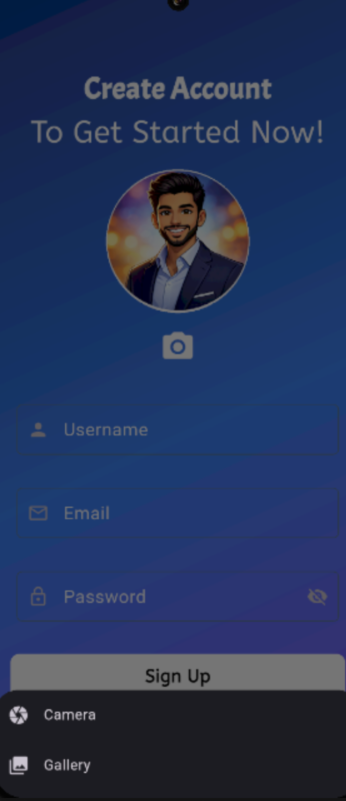
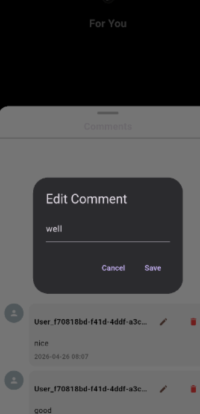
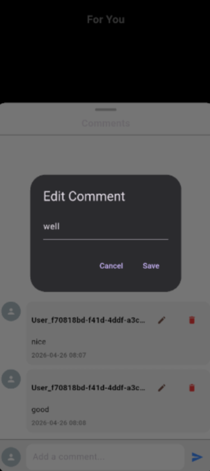
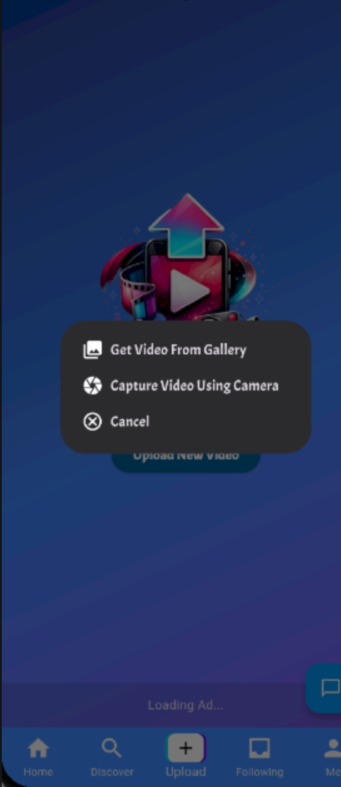
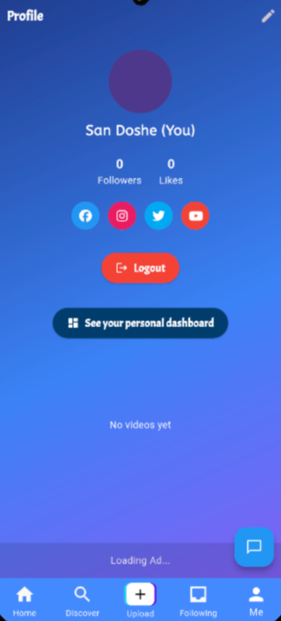
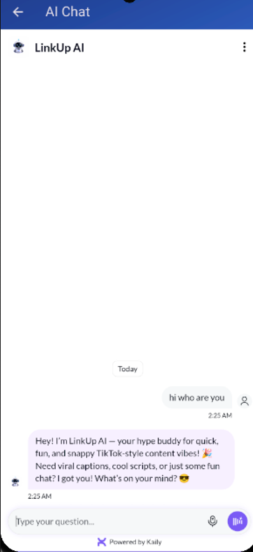

<p align="center">
  
</p>
<p align="center">
  <strong>LinkUp</strong> – A Flutter-based AI-powered online video sharing social networking app.
</p>

## 🚀 Features

- 📹 Upload and share short videos
- 🎬 Video compression before upload
- 🖼️ Automatic video thumbnails
- ▶️ Built-in video player
- 🔗 Share videos externally
- 🔐 Supabase authentication & database
- 📊 Ad integration with Google Mobile Ads
- 🌐 External link launching
- 🎨 Custom fonts with Google Fonts
- ⚡ State management with GetX
- 🤖 Integration with AI-powered chatbot
---

## 🛠️ Tech Stack

| Technology            | Usage                             |
| --------------------- | --------------------------------- |
| **Flutter**           | Cross-platform mobile development |
| **Supabase**          | Backend (Auth, Database, Storage) |
| **GetX**              | State management                  |
| **Dio**               | HTTP networking                   |
| **Google Mobile Ads** | Monetization                      |
| **Video Player**      | Video playback                    |
| **Video Compress**    | Video optimization                |
| **Image Picker**      | Media selection                   |

---

## 📦 Dependencies

Main packages used in the project:

- `supabase_flutter`
- `get`
- `dio`
- `image_picker`
- `video_player`
- `video_compress`
- `video_thumbnail`
- `share_plus`
- `google_mobile_ads`
- `google_fonts`
- `font_awesome_flutter`
- `url_launcher`

---

## 📷 Screenshots

<table>
  <tr>
    <td></td>
    <td></td>
    <td></td>
  </tr>
  <tr>
    <td></td>
    <td></td>
    <td></td>
  </tr>
  <tr>
    <td></td>
    <td></td>
    <td></td>
  </tr>
 <tr>
    <td></td>
    <td></td>
    <td></td>
  </tr>
   <tr>
    <td></td>
    <td></td>
    <td></td>
  </tr>
</table>

---

## ⚙️ Environment Setup

Create a `.env` file in the root directory:

```env
SUPABASE_URL=your_supabase_url
SUPABASE_ANON_KEY=your_supabase_anon_key
```

⚠️ Make sure to replace the placeholders with your actual Supabase credentials.

---

## ▶️ Getting Started

### 1️⃣ Clone the repository

```bash
git clone https://github.com/San2021331091/LinkUp.git
cd LinkUp
```

### 2️⃣ Install dependencies

```bash
flutter pub get
```

### 3️⃣ Run the app

```bash
flutter run
```

---

## 🔧 Build APK

```bash
flutter build apk --release
```

---

## 💰 User Earnings Dashboard (Go Backend)

This project includes a lightweight **Go based real backend service** to fetch and display user earnings from Supabase.

### ✨ Features

- 📊 Fetch user earnings per video
- ❤️ Earnings from likes
- 💬 Earnings from comments
- 🧾 Total earnings calculation
- 🖼️ Video thumbnail + title display
- 👤 User profile info included
- ⚡ Fast REST API using Go

---

## 🔗 API Endpoint

```
GET /user_earning?user_id=YOUR_USER_ID
```

---

## 🖥️ Dashboard UI

The Go server renders an HTML dashboard:

```
/templates/user_earning.html
```

It shows:

- 🎬 Video preview (thumbnail)
- 🎵 Video title
- 💰 Earnings breakdown
- 📅 Last updated time
- 👤 User info

---

## ⚙️ Run Go Server

### 1️⃣ Install Go

Make sure Go is installed:

```
go version
```

---

### 2️⃣ Run Server

```bash
go run main.go
```

---

### 3️⃣ Open in Browser

```
http://localhost:8500/user_earning?user_id=YOUR_USER_ID
```

---

## 🔐 Environment Variables

Update your Go file:

```go
const supabaseURL = "your supabase url"
const supabaseKey = "your supabase anon key"
```

---

## 🧠 How It Works

- Go server calls **Supabase REST API**
- Joins:
  - `member_earnings`
  - `videos`
  - `users`

- Uses custom JSON parsing for flexible responses
- Renders data using Go templates

---

## 🤝 Contributing

Contributions, issues, and feature requests are welcome.

---

## 📄 License

This project is licensed under the **MIT License**.

---

## 📥 Download

- [Download APK file](https://drive.google.com/file/d/17Kxcc1zUM6o81JwvKfVqVSdABMYTMm-Y/view?usp=sharing)
- [Download AAB file](https://drive.google.com/file/d/15-MeC4Au4x_JbvH_U_Ox8IWewaeao0Ll/view?usp=sharing)
